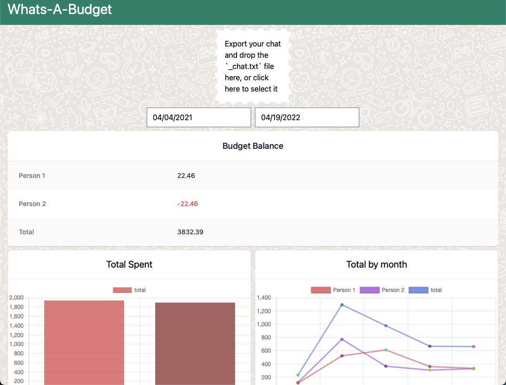
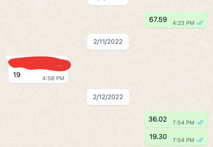
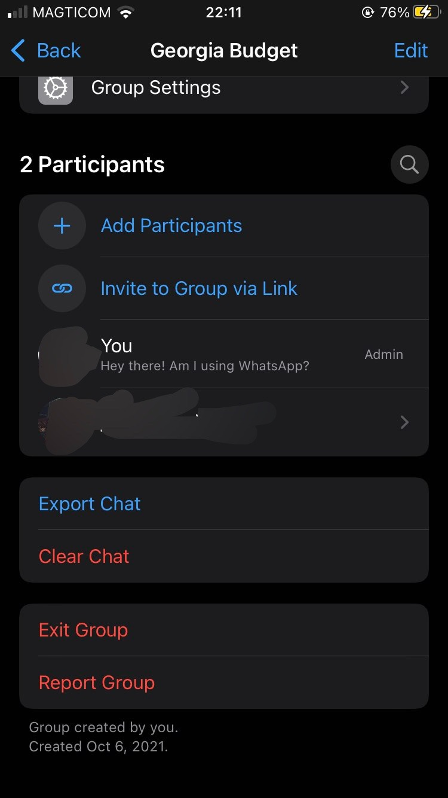

# What's-a-Budget

## What is What's a Budget?

What's a budget allows you to use WhatsApp as a shared budgeting tool.

## It's usefull for

- Couples who just want to keep track of spending to evenly divide the amount at the end of the month
- Groups who want to keep track of spending, but don't require a lot of data
- Friends on vacation

## How do you use it?

1. [Create](https://faq.whatsapp.com/iphone/chats/how-to-create-and-invite-into-a-group) [a whatsapp](https://faq.whatsapp.com/android/chats/how-to-create-and-invite-into-a-group) [group](https://faq.whatsapp.com/web/chats/how-to-create-and-invite-into-a-group) 
2. Everytime you spend something towards the shared budget, just send the amount as a message to the chat
    
3. Export the chat without images. It will be exported as a zip file. Extract `_chat.txt` from the zip file.
    
4. Go to https://1ceb3rg.github.io/whatsabudget/ and select `_chat.txt` or drag and drop it.
5. You can now see who spent what and see at monthly trends
